### What is it

This is small prototype of the web-game. In fact it is not a game, but something like techno-demo with realisations of some mechanics. The main idea is to use [AssemblyScript](https://www.assemblyscript.org/) for creating the core of a game and leave the graphics and all other outputs outside of this core. So, the main part of the game compiled into one single wasm module. The interaction part of the game, written on [TypeScript](https://www.typescriptlang.org/) use this core module to obtain game state and output it to the screen.

There are API for interaction between client and host application. The data from the module to the host transfers by using several external functions, which implemented in the base class of the client.

The host does not contains any game logic. It simply gets game data from the wasm module, recognize it and output to the screen items in different positions and states.

### How to build

**Step 1.** Build wasm module.

```
cd .\wasm\

npm run release
```

This will create ```game_api.wasm``` and ```game_api.js``` files in the ```wasm\build\ ``` directory, and also copy it to the distributive folder ```/dist/build/```.

**Step 2.** Bundle the application by using Parcel:

```
cd ..

npm run build
```

This will create ```build``` directory inside ```dist``` directory with minimized ```module.js```.

### How to play

Currently the project focused in implementation of some game mechanics. So, no graphics, no sound, no texts, no UI. All graphic stuff are drawn by using procedural shapes in 2d-canvas. All controls are made by using mouse and hotkeys.

You can try to play [here](https://tugcga.github.io/games/ProjectH/index.html)

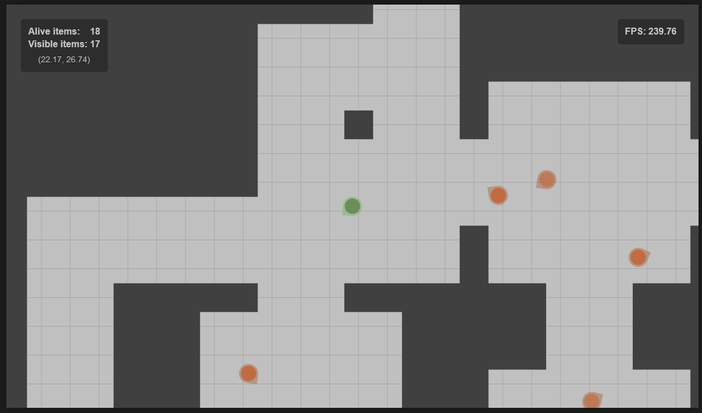

The interface contains simple statistical information. The game is paused by pressing ```Esc```. Pause screen contains hotkeys for controls.

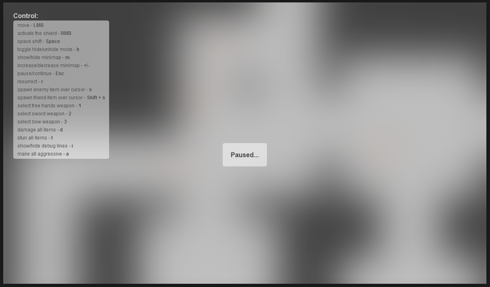

### Implemented mechanics

#### Minimap

The ```m``` key toggle show/hide the level minimap. By using ```+```/```-``` it's possible to zoom in/out this map.

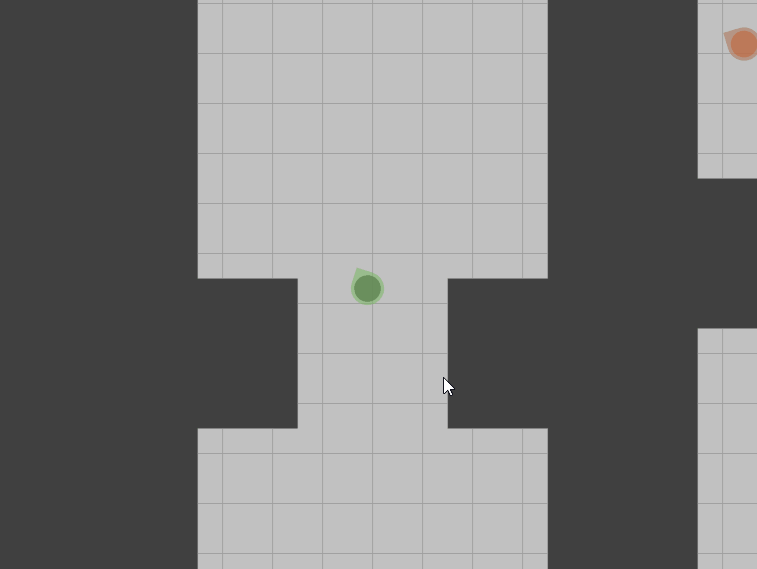

#### Point and click control

Player character moved by pressing left mouse button (LMB).

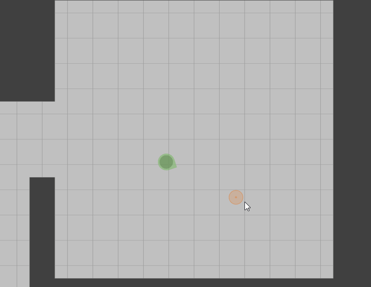

#### Fast shift

By pressing ```Space``` the player character makes fast shift at the direction of the mouse cursor.

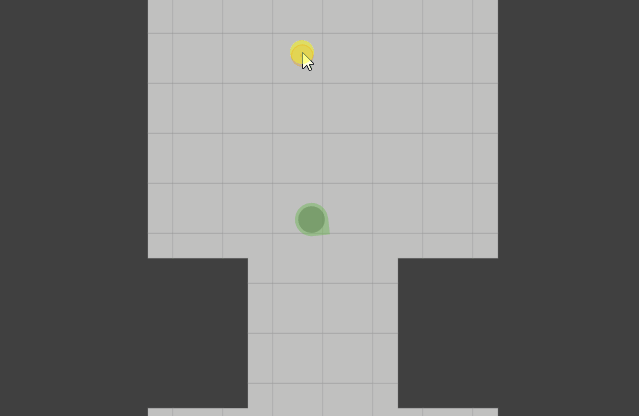

#### Three weapon types

Player character can equip one of three different weapons:
* Use free hands (equipped by default) by pressing ```1```
* Sword by pressing ```2```
* Bow by pressing ```3```

#### Shield

By pressing right mouse button (RMB) the player character activated the shield. The number of hit-points of the shield determined by equipped weapon. It restore if the shield is not activated.

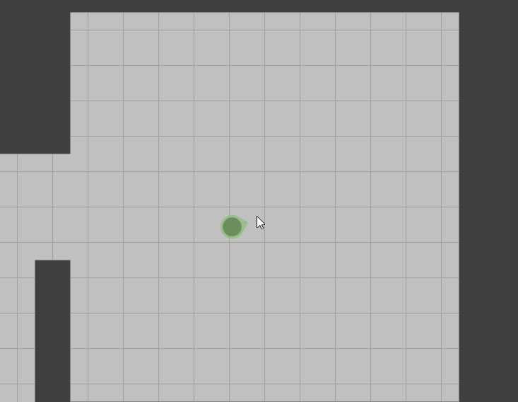

#### Damage

By clicking to the enemy character, the player start move and apply some damage. If the shield is activated, then at first damage reduce the shield value, and only then reduce the character hit points.

Weapons are differed by their damage style. Free hands damage only one target enemy.

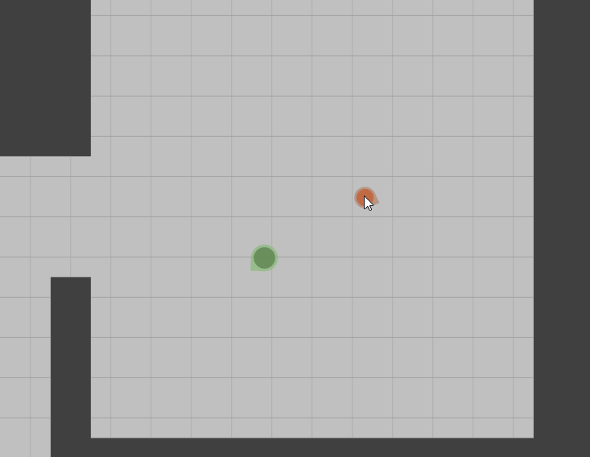

Sword damage all characters inside damage cone. 
 
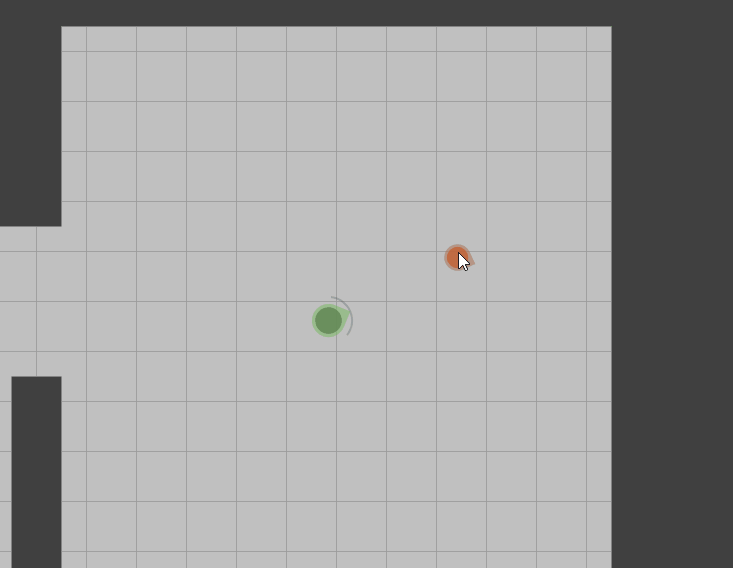

Bow make distant attack.

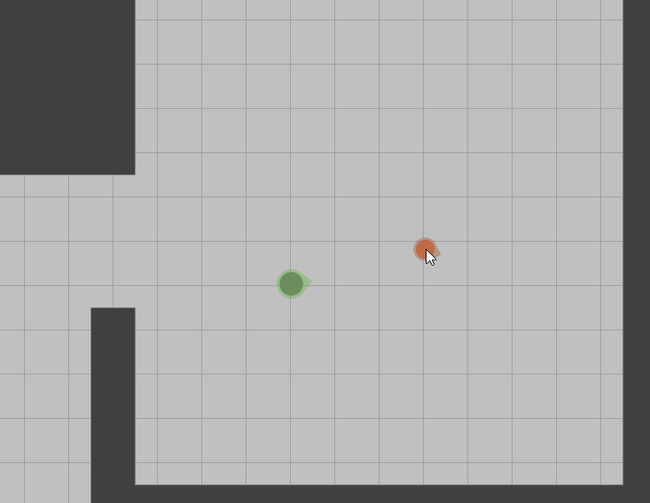

#### Attack interruption

If the character activated the shield after enemy start attack, then it stun the enemy. The damage is affected to the character. If the character shield is activated after the enemy bow emit the arrow, then this arrow does not effect the character.

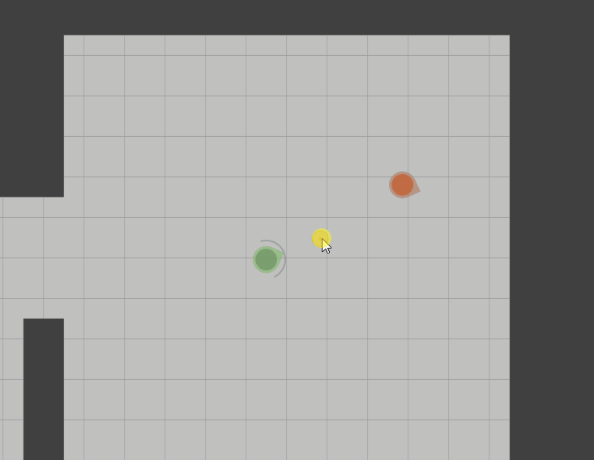

#### Battle skills

There are two battle skills which can be used when the player character equipped with the sword. 
* Round attack activated by pressing ```q```. The character apply damage to all enemies in some radius.
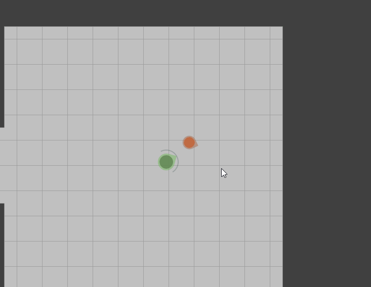
* Stun Cone activated by pressing ```w```. The character damage all enemies in the cone and stun it on some time.
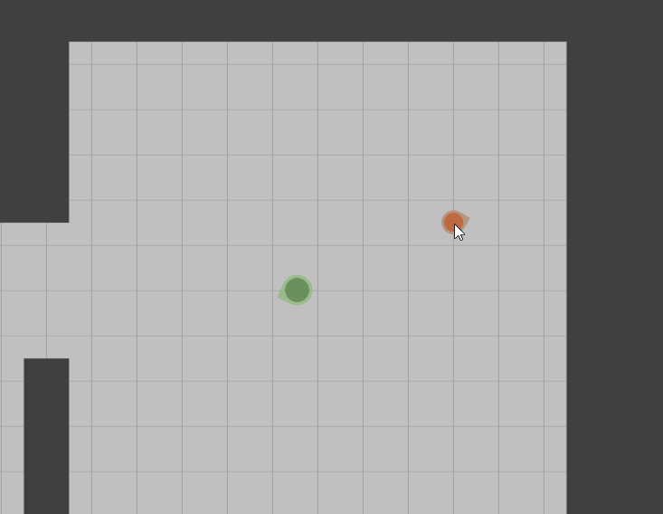

#### Enemies search

Each character looks around and detect characters in direct visibility inside search radius. When enemy is detected, then the character and all other neighbourhood characters start to attack it.

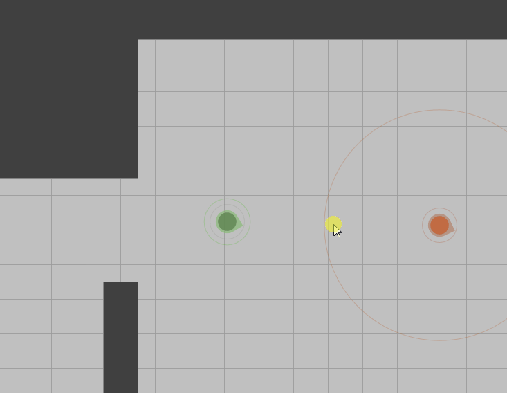

#### Hide mode

Player character can turn into hide mode by pressing ```h```. In this mode the move speed is decreased, but all other enemy characters can detect it only when it appears in the visibility cone. If hide character is detected, then it turns into unhide mode.

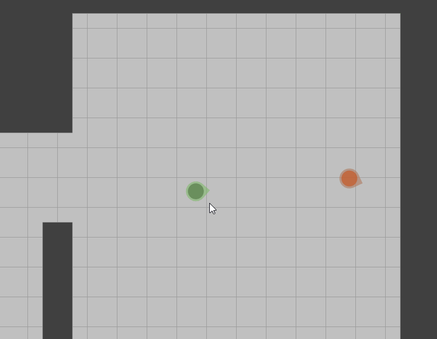

#### Shadow attack

Attack in hide mode kills the enemy by one strike.

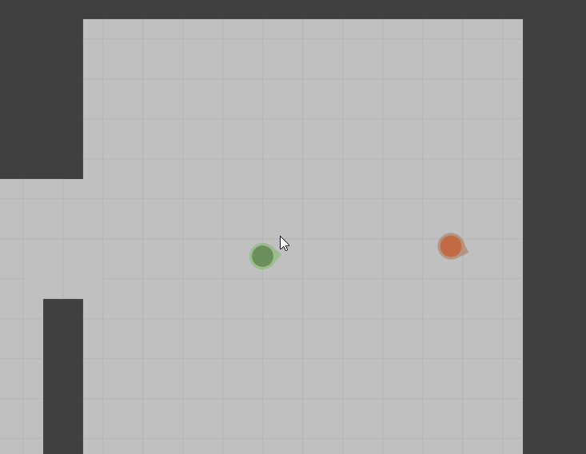

### Battle


## Remarks

The wasm module based on the following side-projects:
* [AS Simple ECS](https://github.com/Tugcga/as_simple_ecs) as entity-component-system framework
* [Dungeons](https://github.com/Tugcga/Dungeons/tree/main/assemblyscript/promethean) for generating the level
* [Path Finder](https://github.com/Tugcga/Path-Finder/tree/main/assemblyscript) for baking navigation mesh of the level and use it for compute paths

May be the wasm module should be rewritten into [Rust](https://www.rust-lang.org/), at least to compare AssemblyScript module vs Rust module for the performance and compiled size.

For now the graphical front-end based on simple browser 2d-canvas without any addons and extensions. It's possible (and it's planned) to add the other front-end based on [Playcanvas](https://playcanvas.com/) for creating 3d-version of the game without any changes of the core wasm module.

## Statistics from [cloc](https://github.com/AlDanial/cloc)

Client sources:

```
-------------------------------------------------------------------------------
Language                     files          blank        comment           code
-------------------------------------------------------------------------------
TypeScript                      26            598            199           3126
-------------------------------------------------------------------------------
```

WASM module sources

```
-------------------------------------------------------------------------------
Language                     files          blank        comment           code
-------------------------------------------------------------------------------
TypeScript                     137           3178           1788          18985
-------------------------------------------------------------------------------
```