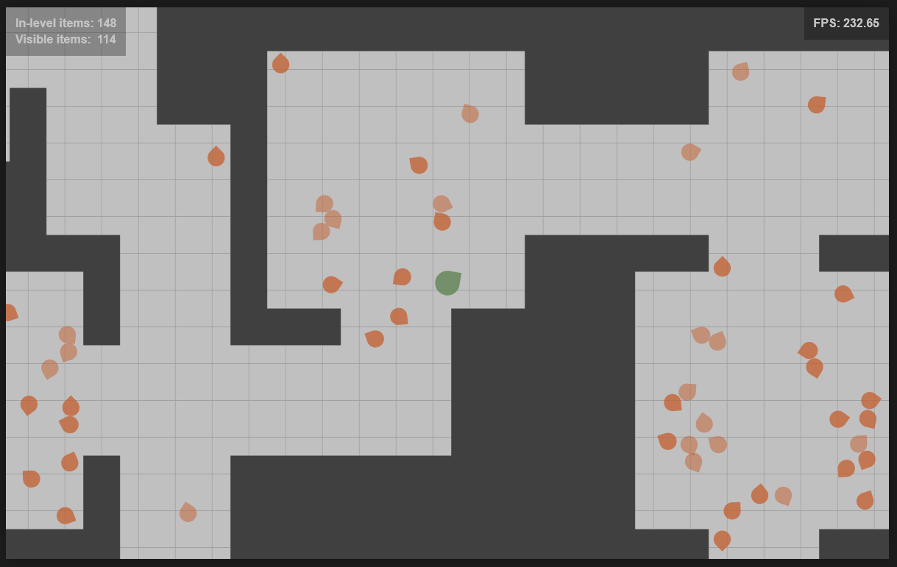

## What is it

This is small prototype of the web-game. In fact it is not a game, but something like techno-demo. The main idea is to use [AssemblyScript](https://www.assemblyscript.org/) for creating the core of a game and leave the graphics and all other outputs outside of this core. So, the main part of the game compiled into one single wasm module. The interaction part of the game, written on [TypeScript](https://www.typescriptlang.org/) use this core module to obtain game state and output it to the screen.

The main principles are the following. Wasm module exports the following functions:
* ```create_game(seed: u32)``` This function should be called at the very beginning. It generates the level and prepare all in-game states.
* ```get_game_settings()```  This function returns plain float array with initial game states.
* ```get_game_data()``` This function returns plain float array with all data about items in the game.
* ```game_update(dt: f32)```  Update internal game states, ```dt``` is delta time.
* ```define_player_target_position(in_x: f32, in_y: f32)``` Set destination point for the player.

All interactions between wasm module and host can use only these functions. The data from the module to the host transfers by using plain arrays for performance reasons. Only one function call for every frame.

The host does not contains any game logic. It simply gets game data from the wasm module, recognize it and output to the screen items in different positions and states.

## How to build

**Step 1.** Build wasm module.

```
cd .\wasm\

npm run full_release
```

This will create ```game_api.wasm``` and ```game_api.js``` files in the ```wasm\build\ ``` directory.

**Step 2.** Bundle the application by using Parcel:

```
cd ..

npm run build
```

This will create ```build``` directory inside ```dst``` directory with minimized ```module.js``` and wasm file.

## How to play

When the application is running, it starts from generating the level. It can takes several seconds. After that it will output to the browser console the following data:

* Used seed for level generation
* Total generation time
* How many tiles are walkable in the generated level

Game controls:

* Click LMB (left mouse button) to set the destination point for the player
* ```m``` key in the keyboard to toggle the visibility of the level map
* ```+``` and ```-``` with active map for scale up and down
* ```s``` key in the keyboard to add some movable items to the random room

The player can only move over the level and see other movable items. These items also can only move to randomly selected positions.

There is a statistics at the top of the window:

* How many movable items in the level
* How many movable items in the neighborhood of the player
* The average fps. It updates every two seconds



## Remarks

When the game window is non-active in the browser, then the error about array out of range can be rised (```Index out of range in ~lib/staticarray.ts:78:41```). If the window is always active - all should works fine.

The wasm module based on the following side-projects:
* [AS Simple ECS](https://github.com/Tugcga/as_simple_ecs) as entity-component-system framework
* [Dungeons](https://github.com/Tugcga/Dungeons/tree/main/assemblyscript/promethean) for generating the level
* [Path Finder](https://github.com/Tugcga/Path-Finder/tree/main/assemblyscript) for baking navigation mesh of the level and making item move routine

May be the wasm module should be rewritten into [Rust](https://www.rust-lang.org/), at least to compare AssemplyScript module vs Rust module for the performance and compiled size.

For now the graphical front-end based on simple browser 2d-canvas without any addons and extensions. It's possible (and it's planned) to add the other front-end based on [Playcanvas](https://playcanvas.com/) for creating 3d-version of the game without any changes of the core wasm module.